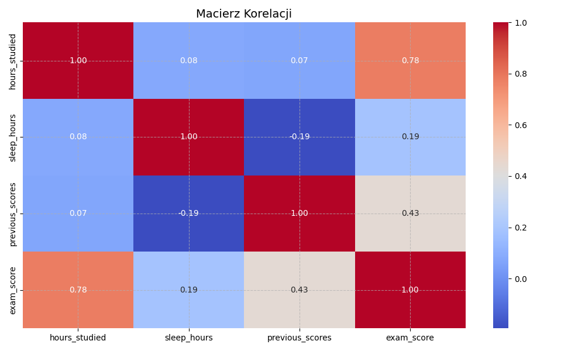
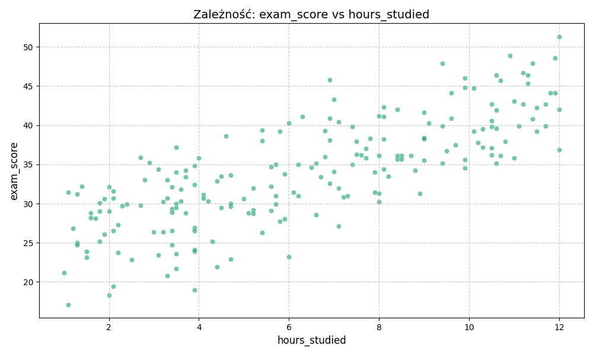
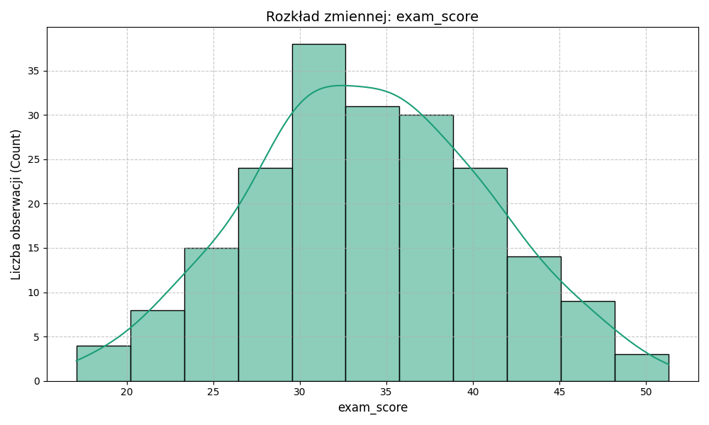
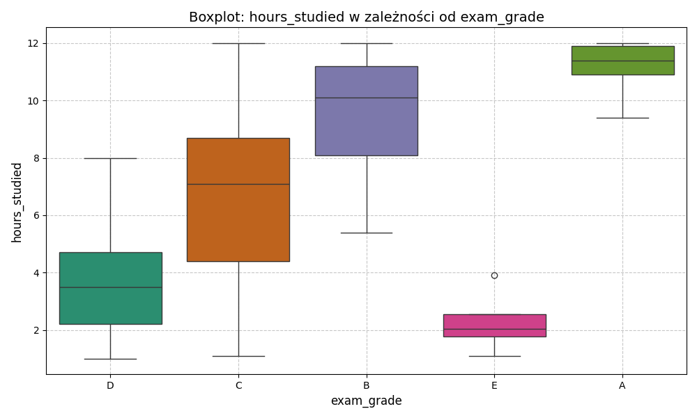
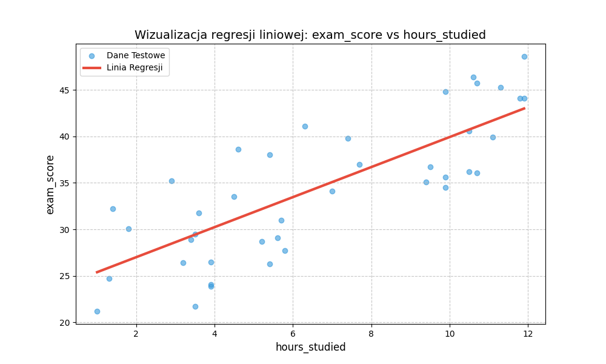
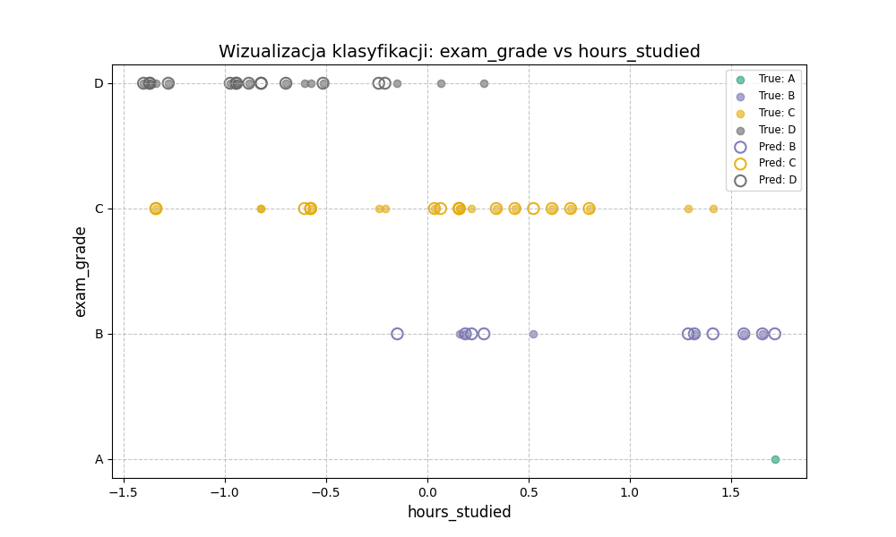
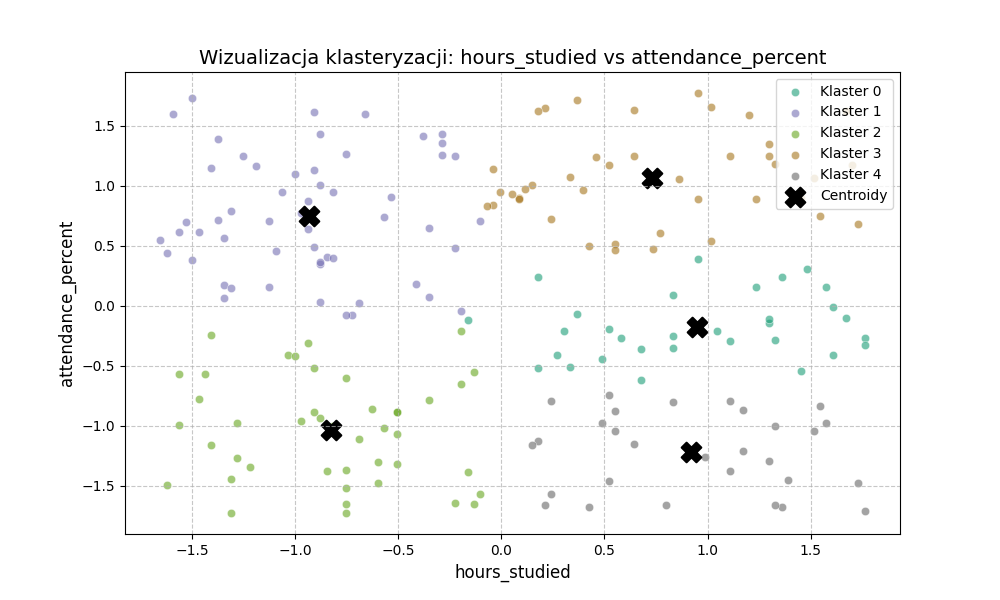

# Narzędzie do analizy danych z elementami uczenia maszynowego w Pythonie

Projekt implementuje modularne i elastyczne narzędzie do analizy danych (Data Analysis Tool) wykorzystujące zaawansowane techniki programowania obiektowego (OOP) w Pythonie, ze szczególnym uwzględnieniem modelowania predykcyjnego z użyciem biblioteki Scikit-learn.

## 🎯 Cel Projektu

Głównym celem jest zademonstrowanie umiejętności w zakresie:
* **Modularnej Dekompozycji** kodu na logiczne klasy i pakiety
* **Programowania Obiektowego** (Dziedziczenie, Abstrakcja)
* **Efektywnego Użycia** kluczowych bibliotek analitycznych (Pandas, Scikit-learn, Matplotlib)
* **Obsługi Błędów** (własne wyjątki i walidacja danych)

***

## ⚙️ Wymagania i Instalacja

Projekt wymaga środowiska **Python 3.9+** oraz następujących bibliotek:

* `pandas`
* `scikit-learn`
* `matplotlib`
* `seaborn`
* `numpy`

### Instalacja
1. Klonowanie repozytorium
git clone https://github.com/vvovvel/Data-Analysis-Tool-with-Machine-Learning-Elements-in-Python.git  
cd Data-Analysis-Tool-with-Machine-Learning-Elements-in-Python

2. Instalacja zależności
pip install -r requirements.txt

3. Uruchomienie
python main.py


## 📦 **Struktura Projektu i Opis Modułów**

Projekt opiera się na **separacji obowiązków**, gdzie każda domena ma swój własny pakiet.

| Pakiet / Moduł | Główna Odpowiedzialność                                                                                        |
| :--- |:---------------------------------------------------------------------------------------------------------------|
| **`main.py`** | Sterowanie pipeline'em, wybór danych do analizy, obsługa błędów.                                               |
| **`data/`** | Ładowanie i walidacja danych, uzupełnianie wartości NA.                                                        |
| **`analysis/`** | Obliczenia statystyczne oraz wizualizacja przy pomocy wykresów scatter, histogram, boxplot.                    |
| **`ml/`** | Klasy reprezentujące*modele ML (klasa bazowa i dziedziczące) oraz przygotowywanie danych do ich implementacji. |
| **`outputs/`** | Folder do zapisu wszystkich wygenerowanych wykresów i logów czasowych.                                         |
| **`tests/`** | Testy jednostkowe statystyk i walidatora.                                                                      |
| **`utils/`** | Context Manager logujący czas i decorator wypisujący czas działania funkcji.                                   |


## 📁 Szczegółowa struktura katalogów 
```
projekt/
├── analysis/
│ ├── plots.py              # Funkcje wizualizacji (scatter, boxplot, histogram)
│ └── statistics.py         # Funkcje obliczające statystyki
├── data/
│ ├── exceptions.py                                     # Klasa InvalidDataError
│ ├── loading_and_prep.py                               # Praca z danymi 
│ ├── Sleep_health_and_lifestyle_dataset.csv            #przykładowy dataset nr 1
│ └── student_exam_scores.csv                           #przykładowy dataset nr 2
├── ml/
│ ├── BaseModel.py          # Klasa abstarakcyjna zawierająca powielający się kod modeli
│ ├── ClassifierModel.py    # Klasyfikacja KNN
│ ├── ClusteringModel.py    # Klasteryzacja KMeans
│ ├── DataPreparer.py       # Preprocessing dla ML (skalowanie, One-Hot Encoding)
│ ├── ModelRunner.py        # Factory/Strategy, użycie @measure_time
│ └── RegressionModel.py    # Regresja Liniowa
├── outputs/                
├── tests/
│ ├── test_statistics.py    # Testy jednostkowe funkcji statystycznych
│ └── test_validator.py     # Testy jednostkowe walidacji danych 
├── utils/
│ ├── context_manager.py    # Klasa TimeLoggerContext
│ └── decorator.py          # Funkcja @measure_time
├── main.py
└── README.md 
```
## 📑 Wyniki Działania Pipeline'u (Przykłady)

Poniżej przedstawiono przykłady plików i wyników generowanych automatycznie przez program po uruchomieniu jednego z pipeline'ów zdefiniowanych
w main.py (test_pipeline_exams()). Wszystkie pliki wynikowe są zapisywane w katalogu `outputs/`.

Surowe wyjście z konsoli po pomyślnym uruchomieniu pipeline'u test_pipeline_exams():

```
============================= test session starts =============================
collecting ... collected 1 item

main.py::test_pipeline_exams PASSED                     [100%]
=== STATYSTYKI: Podstawowe Statystyki Opisowe ===
                mean    std    min    max
hours_studied    6.33   3.23   1.00  12.00
sleep_hours      6.62   1.50   4.00   9.00
previous_scores 66.80  15.66  40.00  95.00
exam_score      33.95   6.79  17.10  51.30
|--- Czas wykonania 'run_summary_stats': 0.0064 s

=== STATYSTYKI: Średnia exam_score wg hours_studied ===
              Średnia exam_score
Group                              
(0.999, 3.5]               27.93
(3.5, 6.15]                30.64
(6.15, 9.0]                36.10
(9.0, 12.0]                41.41
|--- Czas wykonania 'run_grouped_mean': 0.0037 s

=== STATYSTYKI: Macierz Korelacji ===
                  hours_studied  sleep_hours  previous_scores  exam_score
hours_studied              1.00         0.08             0.07        0.78
sleep_hours                0.08         1.00            -0.19        0.19
previous_scores            0.07        -0.19             1.00        0.43
exam_score                 0.78         0.19             0.43        1.00
|--- Czas wykonania 'run_correlation_matrix': 0.0057 s
Wykres zapisany: outputs\correlation_matrix.png
Wykres zapisany: outputs\scatter_hours_studied_exam_score.png
Wykres zapisany: outputs\histogram_exam_score.png
Wykres zapisany: outputs\boxplot_exam_grade_hours_studied.png

=== REGRESJA LINIOWA ===
MSE (test_size 0.20): 19.16

Analiza Wpływu Zmiennych
Analiza wpływu na exam_score:
- hours_studied: Wpływ: **Dodatni**, Współczynnik: 1.61
|--- Czas wykonania 'run_regression': 0.0044 s
Wykres modelu zapisany: outputs\linear_students

=== KLASYFIKACJA KNN ===
Dokładność (n_neighbors=3): 0.60
|--- Czas wykonania 'run_classification': 0.0089 s
Wykres modelu zapisany: outputs\knn_students

=== KLASTERYZACJA KMeans ===
Ocena jakości klastrów: {'Silhouette Score': 0.3921}
|--- Czas wykonania 'run_clustering': 2.9901 s
Wykres modelu zapisany: outputs\cluster_students

======================== 1 passed, 7 warnings in 4.92s ========================
```

Poniżej przedstawiono wszystkie 7 wygenerowanych wykresów. Wszystkie pliki PNG są dostępne w folderze `readme_assets/`.

<table style="width:100%;">

  <tr>
    <td style="width: 50%;">
      <h4 align="center">1. Macierz Korelacji</h4>
      
    </td>
<td style="width: 50%;">
      <h4 align="center">4. Wykres Punktowy (Scatter Plot)</h4>
      
    </td>
  </tr>

  <tr>
    <td style="width: 50%;">
      <h4 align="center">3. Histogram (Rozkład Wyników)</h4>
      
    </td>
    <td style="width: 50%;">
      <h4 align="center">2. Boxplot (Ocena vs Godziny Nauki)</h4>
      
    </td>
  </tr>

  <tr>
    <td style="width: 50%;">
      <h4 align="center">5. Regresja Liniowa</h4>
      
    </td>
    <td style="width: 50%;">
      <h4 align="center">6. Klasyfikacja KNN</h4>
      
    </td>
  </tr>

  <tr>
    <td colspan="2" style="padding-top: 20px;">
      <h4 align="center">7. Klasteryzacja KMeans</h4>
      
    </td>
  </tr>

</table>

W pliku `log.txt` zapisuje się czas wykonania każdej analizy:

```
[START] ŁADOWANIE i PREPROCESSING - Tue Dec  2 13:52:49 2025
[END] ŁADOWANIE i PREPROCESSING - Tue Dec  2 13:52:49 2025 | Trwanie: 0.0034s
--------------------------------------------------
[START] STATYSTYKI OPISOWE - Tue Dec  2 13:52:49 2025
[END] STATYSTYKI OPISOWE - Tue Dec  2 13:52:49 2025 | Trwanie: 0.0061s
--------------------------------------------------
[START] STATYSTYKI: Średnia Grupowa - Tue Dec  2 13:52:49 2025
[END] STATYSTYKI: Średnia Grupowa - Tue Dec  2 13:52:49 2025 | Trwanie: 0.0033s
--------------------------------------------------
[START] STATYSTYKI: Macierz Korelacji - Tue Dec  2 13:52:49 2025
[END] STATYSTYKI: Macierz Korelacji - Tue Dec  2 13:52:49 2025 | Trwanie: 0.0053s
--------------------------------------------------
[START] MODEL: REGRESJA LINIOWA - Tue Dec  2 13:52:50 2025
[END] MODEL: REGRESJA LINIOWA - Tue Dec  2 13:52:50 2025 | Trwanie: 0.0038s
--------------------------------------------------
[START] MODEL: KLASYFIKACJA KNN - Tue Dec  2 13:52:50 2025
[END] MODEL: KLASYFIKACJA KNN - Tue Dec  2 13:52:50 2025 | Trwanie: 0.0063s
--------------------------------------------------
[START] MODEL: KLASTERYZACJA KMeans - Tue Dec  2 13:52:50 2025
[END] MODEL: KLASTERYZACJA KMeans - Tue Dec  2 13:52:51 2025 | Trwanie: 1.5262s
--------------------------------------------------

```


## 💻 Jak użyć własnego zbioru danych?

W przypadku tego projektu, aby uruchomić pipeline na własnym pliku CSV, należy:  

1. Umieścić plik CSV w katalogu data/

2. skopiować jedną z gotowych funkcji pipeline (np. `test_pipeline_exams()` lub `test_pipeline_sleep()`) 

3. Wkleić ją zaraz za `test_pipeline_exams()`

4. Podmienić w niej:
   - ścieżkę do danych (`DATA_PATH`)  
   - listy kolumn (`REQUIRED_COLUMNS`, `POSITIVE_COLUMNS`, `FILL_NA_COLS`)  
   - kolumnę identyfikatora (`ID_COL`)  
   - kolumny używane w statystykach, wykresach i modelach ML (`STATS_COLUMNS`, `SCATTER_X/Y`, `HISTOGRAM_X`, `BOXPLOT_X/Y`, `REGRESSION_FEATURES/TARGET`, `CLASSIFICATION_FEATURES/TARGET`, `CLUSTERING_FEATURES`)

5. Jeśli celem jest ograniczenie pipeline'u do np. jedynie wytrenowania i narysowania wykresu Regresji Liniowej, można pominąć odpowiednie kolumny oraz w bloku `try` zostawić jedynie `df`, `run_regression` oraz `lin_model.plot("wybrana_nazwa")`.

6. Podmienić w `if __name__ == "__main__":` zamiast `test_pipeline_sleep()` np. `test_pipeline_youtube()` (jak w poniższym przykładzie).

### Ważne uwagi:
* tool jest w stanie narysować jedynie wykresy 2d, więc w Linear Regression oraz Classifier wymagana jest dokładnie jedna cecha i jeden target,
a w KMeans dokładnie dwie cechy 
* zanim zostanie wywołany `lin_model.plot()` bądź nastąpi próba wygenerowania jakiegokolwiek innego wykresu ML Modelu, **model musi zostać wytrenowany**.

Przykładowa zmiana:

```Plaintext

    #tu jest def test_pipeline_exams
    
    def test_pipeline_youtube():
    
        DATA_PATH = os.path.join('data', 'YouTube_Shorts_Performance_Dataset.csv')
    
        REQUIRED_COLUMNS = ['video_id', 'duration_sec', 'hashtag_count', 'views', 'likes', 'comments', 'shares', 'upload_hour', 'category']
    
        POSITIVE_COLUMNS = ['duration_sec', 'hashtag_count', 'views', 'likes', 'comments', 'shares', 'upload_hour']
    
        ID_COL = 'video_id'
    
        FILL_NA_COLS = []
    
        FILL_NA_VALUE = 0
        
        #można usunąć wszystkie kolumny niezwiązane z oczekiwanym wynikiem pipelinu
    
        REGRESSION_FEATURES = ['hashtag_count']
        REGRESSION_TARGET = 'views'
   
    
        try:
    
            df = perform_loading_and_prep(DATA_PATH, REQUIRED_COLUMNS, FILL_NA_COLS, FILL_NA_VALUE, POSITIVE_COLUMNS)
 
            #można usunąć wszystkie zbędne dla nas wywyołania 
            
            lin_model = run_regression(df, ID_COL, REGRESSION_TARGET, REGRESSION_FEATURES)
            lin_model.plot("linear_youtube") #zmiana nazwy wykresu 
   
    
        except InvalidDataError as e:
            print(f"Błąd w danych (InvalidDataError): {e}")
        except Exception as e:
            print(f"Wystąpił nieoczekiwany błąd podczas działania programu: {e}")
            
    if __name__ == "__main__":
    test_pipeline_youtube() #należy zmienić nazwę pipelinu 
```

### Co projekt zrobi automatycznie?

- ✔ **Walidacja danych** — sprawdzenie poprawności i kompletności  
- ✔ **Czyszczenie** — usuwanie/uzupełnianie wartości brakujących  
- ✔ **Skalowanie** — normalizacja cech numerycznych  
- ✔ **Kodowanie One-Hot** — przygotowanie zmiennych kategorycznych  
- ✔ **Analiza statystyczna** — opisowe metryki i wizualizacje  
- ✔ **Modele ML** — regresja, klasyfikacja i klasteryzacja  

Po zakończeniu działania pipeline'u wszystkie wyniki oraz wykresy zostaną zapisane w katalogu `outputs/`.


## ➡️ Dalszy rozwój i potencjalne ulepszenia

Projekt został zaprojektowany modularnie, aby umożliwić jego rozbudowę w następujących obszarach:

* **Zwiększenie Odporności Pipeline'u (Soft Failures):** Modyfikacja runnerów ML (`ModelRunner.py`) w celu zapewnienia, że błąd podczas trenowania jednego modelu (np. klasyfikacji) nie przerywa całego procesu analizy, pozwalając na kontynuację kolejnych kroków (np. klasteryzacji).
* **Dodanie Interfejsu Użytkownika (UI):** Zaimplementowanie prostej aplikacji dla użytkownika końcowego (np. opartej na Streamlit lub Flask), która zastąpi obecne, statyczne wywołania funkcji w main.py bardziej dynamicznym wyborem analizy.
* **Rozszerzenie Zestawu Modeli ML:** Dodanie kolejnych algorytmów uczenia maszynowego.
* **Poprawa Wizualizacji (3D i Etykiety):**
    * Implementacja wykresów 3D dla analizy cech (np. trzech cech naraz).
    * Wizualizacja etykiet klastrów/klas na oryginalnych, **nieskalowanych** danych w celu lepszej interpretacji wyników.